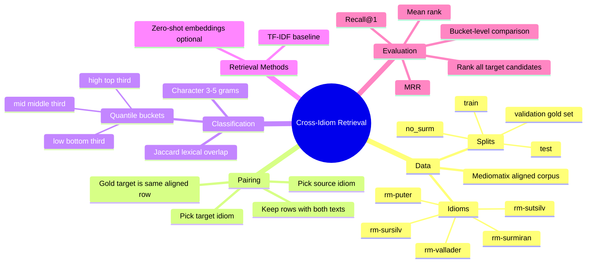
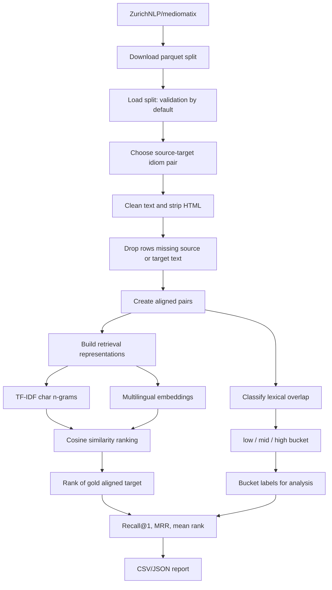
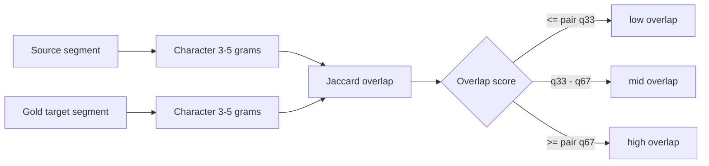
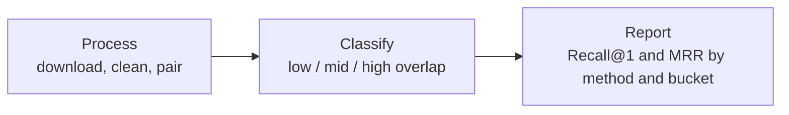

# Retrieval Pipeline Diagrams

These diagrams explain how the retrieval branch separates the data, classifies
lexical-overlap cases, and reports results.

For diagrams based on the TF-IDF validation smoke run, see
[`validation_results.md`](validation_results.md).

## Mind Map

## Process Flow

## Lexical-Overlap Classification

The thresholds are recomputed for each source-target idiom pair, so `low`,
`mid`, and `high` always describe that pair's own lexical-overlap distribution.

## PCR-Style Summary

## Data Separation

| Split | Role in this branch |
| --- | --- |
| `train` | Available for later training/fine-tuning coordination. |
| `validation` | Default gold-standard retrieval evaluation split. |
| `test` | Held for final selected settings. |
| `no_surm` | Extra aligned split without Surmiran coverage. |

## Interpretation

High-overlap rows are the easiest lexical-control condition. Low-overlap rows
are the main RQ2 condition because they show where spelling similarity is less
helpful and semantic retrieval should matter more.
