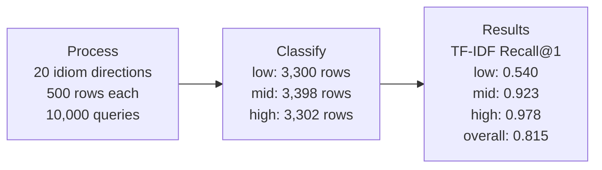
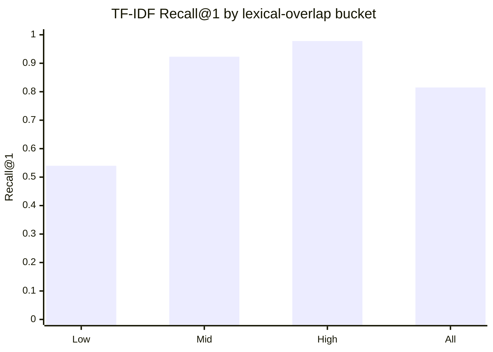
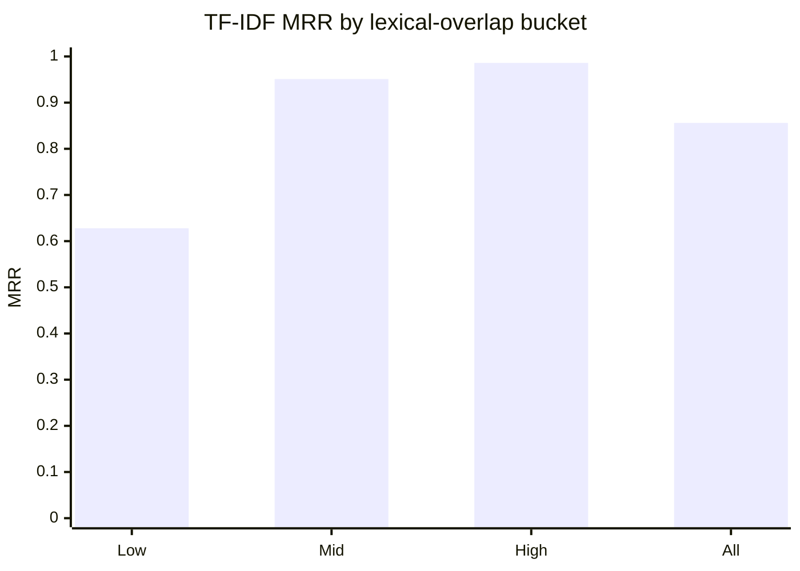
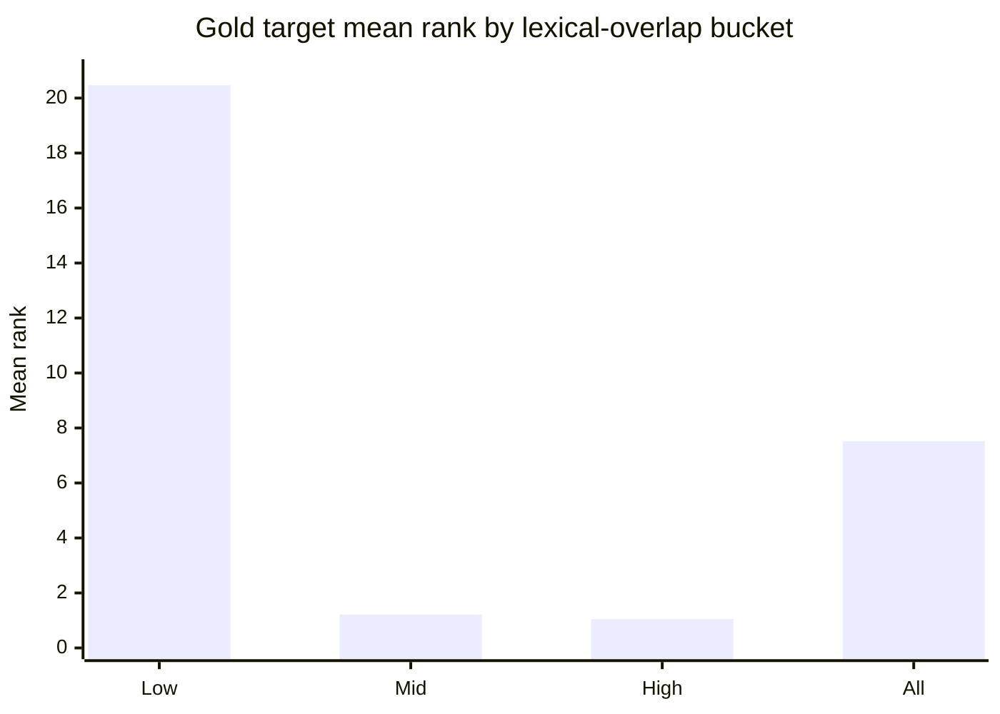
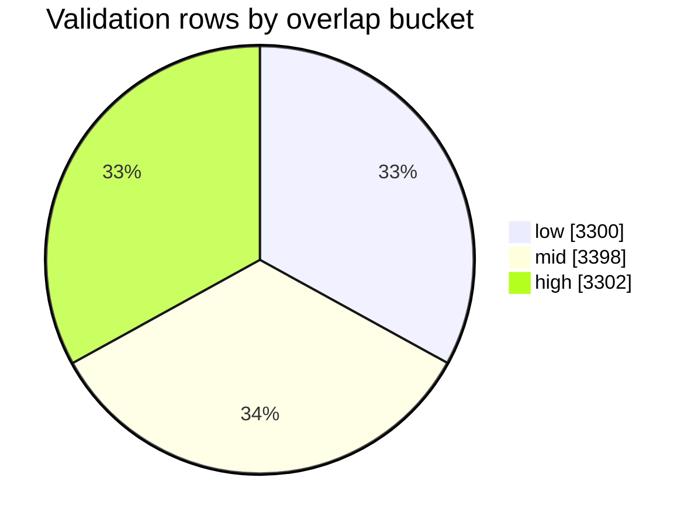
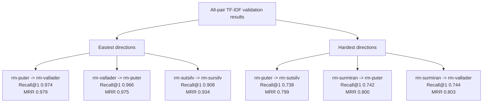
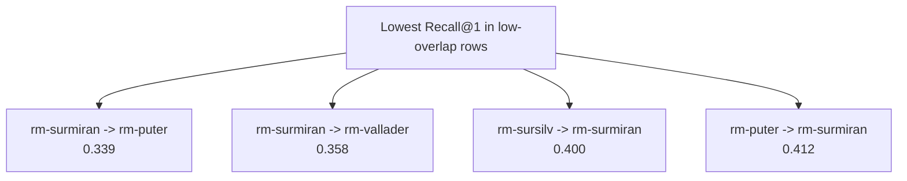

# Actual Validation Results Diagrams

These diagrams summarize the current TF-IDF validation smoke run:

```bash
python3 scripts/run_retrieval.py --split validation --methods tfidf --max-rows 500
```

The run covers all 20 ordered source-target idiom pairs with 500 aligned rows
per pair, for 10,000 retrieval queries in total.

## PCR: Actual Run



## Recall@1 By Overlap Bucket



## MRR By Overlap Bucket



## Mean Rank By Overlap Bucket



## Row Distribution



## Easiest And Hardest Directions



## Low-Overlap Stress Cases



## Actual Summary Table

| Bucket | Rows | Recall@1 | MRR | Mean rank |
| --- | ---: | ---: | ---: | ---: |
| all | 10,000 | 0.815 | 0.856 | 7.52 |
| low | 3,300 | 0.540 | 0.628 | 20.47 |
| mid | 3,398 | 0.923 | 0.951 | 1.22 |
| high | 3,302 | 0.978 | 0.986 | 1.05 |

## Main Takeaway

TF-IDF is already very strong when idioms share spelling patterns. The low-overlap
bucket is the real stress test: performance drops sharply there, which supports
the project motivation for comparing lexical retrieval against semantic
zero-shot embeddings.
